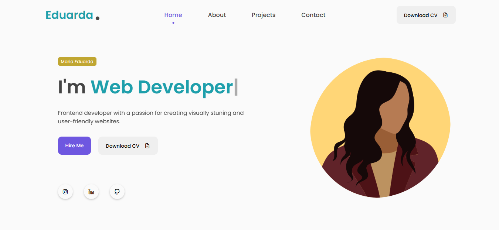
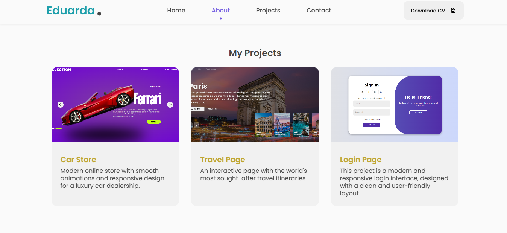

<h1 align="center"> Portfólio </h1>

Meu portfólio pessoal, com links para meus principais projetos.

    <a href="#-tecnologias">Tecnologias</a>&nbsp;&nbsp;&nbsp;|&nbsp;&nbsp;&nbsp;
    <a href="#-projeto">Projeto</a>&nbsp;&nbsp;&nbsp; |&nbsp;&nbsp;&nbsp;
    <a href="#-licença">Licença</a>&nbsp;&nbsp;&nbsp; |&nbsp;&nbsp;&nbsp;

 

    
    

## 🚀 Tecnologias 
Esse projeto foi desenvolvido com as seguintes tecnologias:

- HTML & CSS
- JavaScript
- Git e GitHub

## 💻 Projeto
Portfólio pessoal desenvolvido para apresentar meus projetos e habilidades em Front-End. Projeto moderno e minimalista, com foco em usabilidade e design limpo.

## Licença

Esse projeto está sob a licença MIT.